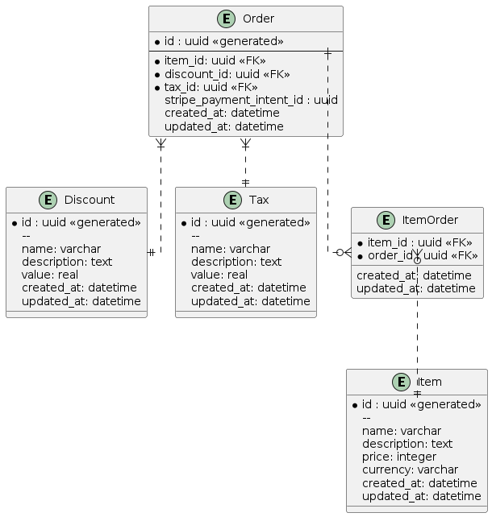
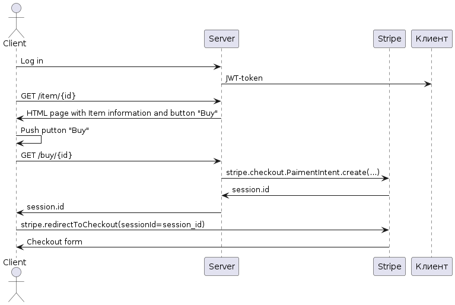

# РЕШЕНИЕ ТЕСТОВОГО ЗАДАНИЯ

[задание](https://docs.google.com/document/u/0/d/1X8yV7jAZWZWhy3NG3m_Yi8lW4Bfa6ZNGDx95pHkE_qc/mobilebasic)

## автор
Сергей Билибин (tg: @sbilibin2017)

## схема базы данных

## логика сервиса

## TODO
- [x] отрисовать схему решения
- [ ] настроить ci
- [ ] настроить инфраструктуру
- [ ] реализовать решение

